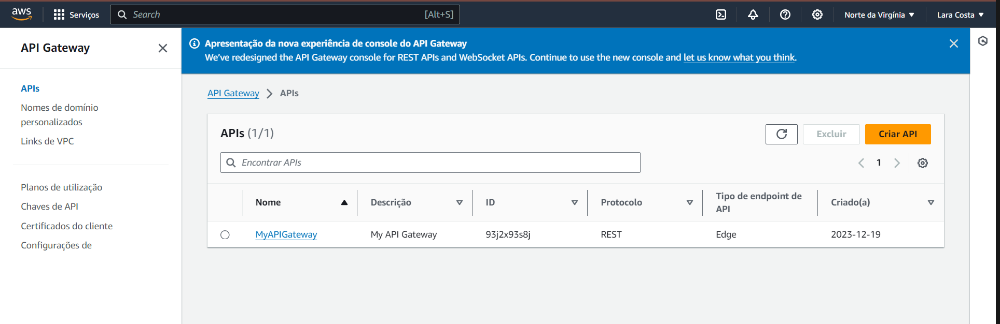

# compass-api-lambda-terraform
### Criar um terraform para deploy do API Gateway e uma Lambda

## VSCode

- Crie uma pasta e dê um nome para ela
- Abra a pasta no **vscode**

1. Crie um arquivo **terraform** com nome de **main.tf**
2. Crie uma pasta com nome **lambda**
- Dentro da pasta **lamdba**, crie o arquivo **index.js**:

```
exports.handler = async (event, context) => {
    return {
        statusCode: 200,
        body: JSON.stringify('Hello from Lambda!'),
    };
};
```

3. no Terminal vá ate a ***Diretório lambda***
- e Inicie o node, com o comando **npm init -y**
- isso vai criar um arquivo **package.json**


4. Instale as Dependências:
- No diretório **lambda/**, execute o seguinte comando para instalar as dependências:

```
npm install
```

5. Crie o Arquivo **lambda.zip**:
- No diretório raiz do seu projeto, execute o seguinte comando para criar o arquivo:

```
# LINUX
zip -r lambda.zip lambda/

---
# WINDOWS

Compress-Archive -Path .\lambda\* -DestinationPath lambda.zip

```


---
### Estrutura do Projeto
- Certifique-se de que sua estrutura do projeto esteja parecida com isso:

```
meu-projeto/
|-- main.tf
|-- lambda/
    |-- index.js
    |-- package.json
    |-- package-lock.json
```

## main.tf

- Agora no arquivo terraform, você vai colocar os resources de: 
- **IAM ROLE, Lambda Function, e API Gateway**

```
terraform {
  required_providers {
    aws = {
      source  = "hashicorp/aws"
      version = "~> 4.16"
    }
  }

  required_version = ">= 1.2.0"
}

provider "aws" {
  region = "us-east-1"
}

resource "aws_lambda_function" "example" {
  function_name = "my-lambda-function"
  handler      = "index.handler"
  runtime      = "nodejs14.x"
  filename     = "lambda.zip" 

  source_code_hash = filebase64("lambda.zip")

  role = aws_iam_role.lambda_exec.arn

  depends_on = [aws_api_gateway_rest_api.example]

  environment {
    variables = {
      key = "value1",
      key = "value2",
    }
  }
}

resource "aws_api_gateway_rest_api" "example" {
  name        = "MyAPIGateway"
  description = "My API Gateway"
}

resource "aws_api_gateway_resource" "example" {
  rest_api_id = aws_api_gateway_rest_api.example.id
  parent_id   = aws_api_gateway_rest_api.example.root_resource_id
  path_part   = "resource"

  lifecycle {
    create_before_destroy = true
  }
}

resource "aws_api_gateway_method" "example" {
  rest_api_id   = aws_api_gateway_rest_api.example.id
  resource_id   = aws_api_gateway_resource.example.id
  http_method   = "GET"
  authorization = "NONE"
}

resource "aws_api_gateway_integration" "example" {
  rest_api_id = aws_api_gateway_rest_api.example.id
  resource_id = aws_api_gateway_resource.example.id
  http_method = aws_api_gateway_method.example.http_method

  integration_http_method = "GET"
  type                    = "AWS_PROXY"
  uri                     = aws_lambda_function.example.invoke_arn
}

resource "aws_api_gateway_deployment" "example" {
  depends_on = [aws_api_gateway_integration.example]

  rest_api_id = aws_api_gateway_rest_api.example.id
  stage_name  = "test"
}

resource "aws_iam_role" "lambda_exec" {
  name = "lambda-exec-role"

  assume_role_policy = jsonencode({
    Version = "2012-10-17",
    Statement = [
      {
        Action = "sts:AssumeRole",
        Effect = "Allow",
        Principal = {
          Service = "lambda.amazonaws.com",
        },
      },
    ],
  })
}

```

1. Agora vamos fazer o **deploy para aws**:
- Use o comando, **terraform init**, para iniciar e instalar os providers
- Depois valide se está tudo certo com o comando, **terraform validate**


2. Agora vamos aplicar esses **resources**
- **terraform apply**

3. No **console AWS**, verifique se a **função lambda** foi criada:


4. No **console AWS**, verifique se a **Api gateway** foi criada:

